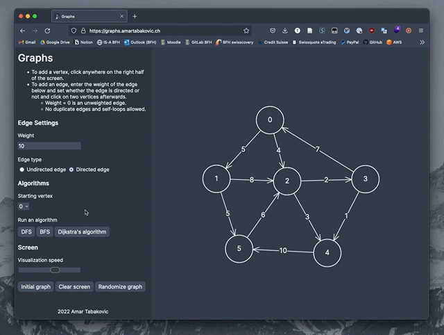

# graphs
A graph algorithm visualizer written in JavaScript using the Canvas API.

Try it out under [graphs.amartabakovic.ch](https://graphs.amartabakovic.ch) (work in progress).

## Credits & Resources
- [webpack-boilerplate](https://github.com/taniarascia/webpack-boilerplate)
- *Algorithm Design and Applications* by Goodrich and Tamassia